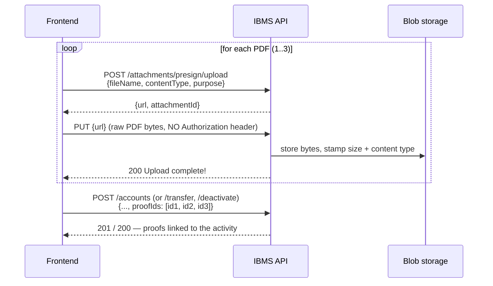

# Account Activity Proofs API Contract

> **Status:** APPROVED
> **Last Updated:** 2026-08-05

Every account activity — **setup** (create), **transfer**, and **deactivation request** — carries **1 to 3 PDF proof files**. This contract covers how those PDFs are uploaded, attached to an activity, and read back afterwards.

Proofs are uploaded **before** the activity is submitted. The upload returns an `attachmentId`; the activity request carries the collected ids in a `proofIds` array. Each proof is tagged with the purpose of the activity that attached it, so an account's subscription proofs, transfer proofs and deactivation proofs stay cleanly separated.

---

## Endpoints

All endpoints require authentication **except** the blob transfer routes, where the signed token in the URL is itself the credential.

| Method | Path | Role Required | Description |
|--------|------|---------------|-------------|
| POST | `/attachments/presign/upload` | Any authenticated | Reserve an attachment and get a signed upload URL |
| PUT | `/attachments/{id}/blob?token=` | **None** (token-gated) | Upload the PDF bytes |
| GET | `/attachments/{id}/blob?token=` | **None** (token-gated) | Download the bytes |
| GET | `/attachments/{id}/presign/download` | Any authenticated | Get a signed download URL for one attachment |
| GET | `/accounts/{id}/attachments` | Any authenticated | List an account's proofs, optionally filtered by purpose |
| GET | `/transfers/{id}/attachments` | Any authenticated | List the proofs attached to one transfer |

Activity endpoints that accept `proofIds` (documented in their own contracts, summarised here):

| Method | Path | Role Required | Proof purpose |
|--------|------|---------------|---------------|
| POST | `/accounts` | SECRETARY, FINANCE | `subscription_proof` |
| POST | `/accounts/isp` | SECRETARY, FINANCE | `subscription_proof` |
| POST | `/accounts/{id}/transfer` | SECRETARY | `transfer_proof` |
| POST | `/transfers` | SECRETARY | `transfer_proof` |
| POST | `/accounts/{id}/deactivate` | SECRETARY | `deactivation_proof` |

---

## Upload Flow

Three steps per file. Steps 1 and 2 repeat for each of the 1–3 PDFs; step 3 submits them together.



**The signed URL expires 900 seconds (15 minutes) after it is issued.** If a user picks files and then leaves the form open, presign at submit time rather than at file-select time.

---

## POST `/attachments/presign/upload`

Reserves an attachment row and returns a short-lived signed URL to PUT the bytes to. The row exists but is empty until step 2 completes — an attachment that was presigned and never uploaded is **rejected** by the activity endpoints.

### Request

Headers:

```
Authorization: Bearer <jwt>
Content-Type: application/json
```

Body:

```json
{
  "fileName": "subscription-contract.pdf",
  "contentType": "application/pdf",
  "purpose": "subscription_proof"
}
```

| Field | Type | Required | Description |
|-------|------|----------|-------------|
| `fileName` | `string` | No | Original file name. Stored and echoed back by the list endpoints so the UI can label the proof. Defaults to `"file"`. |
| `contentType` | `string` | No | MIME type. **Must be `application/pdf`** when `purpose` is a proof purpose. |
| `purpose` | `string (enum)` | No | `subscription_proof` \| `transfer_proof` \| `deactivation_proof` \| `installation_proof` \| `closure_proof` \| `ocr_source`. Defaults to `subscription_proof`. |

**The purpose must match the activity the file is for.** A `subscription_proof` cannot be used as a deactivation proof — the activity endpoint returns `400`.

### Success — `200 OK`

```json
{
  "result": "success",
  "message": "Presigned URL generated!",
  "status": "200",
  "data": {
    "url": "http://localhost:8080/attachments/3f9a.../blob?token=1754400000:9c2b...",
    "attachmentId": "3f9a1c44-0e21-4b8a-9d3e-77a1b2c3d4e5"
  }
}
```

### Errors

| Status | Condition | Message |
|--------|-----------|---------|
| 400 | `contentType` is set to something other than `application/pdf` for a proof purpose | `a subscription_proof must be uploaded as application/pdf` |
| 400 | Unknown `purpose` value | `malformed or invalid request body` |
| 401 | Missing or invalid JWT | `authentication required` |

---

## PUT `/attachments/{id}/blob?token=`

Uploads the bytes. Call the **exact `url` returned by the presign step** — it already carries the token.

### Request

```
Content-Type: application/pdf
```

> **Do NOT send an `Authorization` header.** This route is public; the token in the query string is the credential.

Body: the raw PDF bytes (not multipart, not base64).

### Success — `200 OK`

```json
{ "result": "success", "message": "Upload complete!", "status": "200", "data": null }
```

### Errors

| Status | Condition | Message |
|--------|-----------|---------|
| 400 | File is larger than 10 MB | `PDF exceeds the 10 MB limit` |
| 400 | Bytes are not a PDF (must begin with `%PDF`) | `proof file must be a PDF` |
| 400 | Empty body | `uploaded file is empty` |
| 400 | `token` query parameter absent | `missing token` |
| 401 | Token invalid or older than 900 s | `invalid or expired upload token` |
| 404 | Unknown attachment id | `attachment {id} not found` |

**Size limit: 10 MB per file.** Validate client-side before uploading — the server rejects an oversized body from the `Content-Length` header without reading it.

---

## GET `/attachments/{id}/blob?token=`

Returns the raw bytes with the stored `Content-Type` (`application/pdf` for proofs). No `Authorization` header. Get the URL from `downloadUrl` on a list endpoint, or from `GET /attachments/{id}/presign/download`.

---

## GET `/attachments/{id}/presign/download`

### Success — `200 OK`

```json
{
  "result": "success",
  "message": "Presigned URL generated!",
  "status": "200",
  "data": { "url": "http://localhost:8080/attachments/3f9a.../blob?token=1754400900:aa71..." }
}
```

| Status | Condition |
|--------|-----------|
| 404 | Unknown attachment id |

---

## Submitting proofs with an activity

All five activity endpoints accept the same field.

| Field | Type | Required | Description |
|-------|------|----------|-------------|
| `proofIds` | `string[] (UUID)` | **Yes** | 1 to 3 attachment ids, each fully uploaded and of the purpose that activity expects. Order is preserved and returned as `sortOrder`. |
| `proofId` | `string (UUID)` | No | **Deprecated.** The single-proof form, still accepted. Ignored when `proofIds` is present and non-empty. |

`POST /accounts` and `POST /accounts/isp` use the field name **`subscriptionProofIds`** (the deprecated scalar there is `subscriptionProofId`, on `/accounts/isp` only). The 1–3 rule is identical.

Examples:

```jsonc
// POST /accounts
{ "accountNumber": "71214756", "providerId": "...", "storeId": "...",
  "rate": "1500.00", "installationDate": "2026-01-15",
  "subscriptionProofIds": ["uuid-1", "uuid-2", "uuid-3"] }

// POST /accounts/{id}/transfer
{ "newStoreId": "uuid-of-destination-store", "proofIds": ["uuid-1", "uuid-2"] }

// POST /accounts/{id}/deactivate
{ "proofIds": ["uuid-1"] }
```

### Validation errors — all `400 Bad Request`

| Condition | Message |
|-----------|---------|
| No proofs supplied | `at least one {field} is required` (create: `a subscription proof (PDF) is required`) |
| More than 3 supplied | `at most 3 files may be attached to {field}` |
| The same id twice | `{field} contains duplicate attachment ids` |
| Id does not exist | `a valid {field} is required` |
| Presigned but never uploaded | `{field} has not been uploaded yet` |
| Uploaded file is not a PDF | `{field} must be a PDF file` |
| Wrong purpose for this activity | `{field} must reference a transfer_proof attachment` |

> **An unknown attachment id returns `400`, not `500`.** Earlier builds surfaced a database foreign-key error for any id past the first; every id is now validated before anything is written.

---

## GET `/accounts/{id}/attachments`

Every proof ever attached to the account, newest activity first.

### Request

```
Authorization: Bearer <jwt>
```

| Query param | Type | Required | Description |
|-------------|------|----------|-------------|
| `purpose` | `string (enum)` | No | Return only proofs of this purpose — `subscription_proof`, `transfer_proof`, `deactivation_proof`. Omit for all. |

### Success — `200 OK`

```json
{
  "result": "success",
  "message": "success",
  "status": "200",
  "data": [
    {
      "attachmentId": "3f9a1c44-0e21-4b8a-9d3e-77a1b2c3d4e5",
      "purpose": "deactivation_proof",
      "fileName": "termination-letter.pdf",
      "contentType": "application/pdf",
      "sizeBytes": 248311,
      "sortOrder": 0,
      "linkedAt": "2026-08-05T02:14:07Z",
      "linkedBy": "uuid-of-user",
      "transferId": null,
      "downloadUrl": "http://localhost:8080/attachments/3f9a.../blob?token=1754400900:aa71..."
    }
  ]
}
```

| Field | Type | Description |
|-------|------|-------------|
| `attachmentId` | `string (UUID)` | The attachment. |
| `purpose` | `string (enum)` | The purpose of the **activity that attached it**. |
| `fileName` | `string \| null` | Original upload name. `null` for legacy rows whose name could not be recovered. |
| `contentType` | `string \| null` | Always `application/pdf` for proofs. |
| `sizeBytes` | `number \| null` | Actual stored size. |
| `sortOrder` | `number` | Position within its activity, `0`–`2`. |
| `linkedAt` | `string (ISO 8601)` | When the activity attached it. **All proofs of one activity share this value exactly** — group by it to render "the 2 PDFs from this deactivation request". |
| `linkedBy` | `string (UUID) \| null` | The user who performed the activity. |
| `transferId` | `string (UUID) \| null` | Set only on `transfer_proof` rows; identifies the transfer. |
| `downloadUrl` | `string` | Signed GET URL, **valid 900 s**. |

Ordering: `linkedAt` descending, then `sortOrder` ascending. Not paginated — an activity carries at most 3 proofs.

> **Do not cache or persist `downloadUrl`.** It expires in 15 minutes. Re-fetch the list, or call `GET /attachments/{id}/presign/download`, when a user clicks through to a proof.

| Status | Condition |
|--------|-----------|
| 400 | Unrecognised `purpose` value |
| 404 | Unknown account id |

---

## GET `/transfers/{id}/attachments`

The proofs of one transfer, same `AccountProof` object as above (`transferId` populated, deduplicated across the source and destination account). Returns `404` for an unknown transfer id.

---

## How proofs attach to each activity

| Activity | Purpose | Attached to |
|----------|---------|-------------|
| Account setup | `subscription_proof` | The new account |
| Transfer | `transfer_proof` | **Both** the source account and the new account created at the destination store, plus the transfer record |
| Deactivation request | `deactivation_proof` | The account |

A transfer creates a *new* account at the destination store. Its proofs are visible from either account's `/attachments` list, and the new account's `subscriptionProofIds` carries only the subscription proofs it inherited — never the transfer's.

---

## Worked Example

Create an account with 3 proofs, then request deactivation with 2 more.

```bash
TOKEN="<secretary-jwt>"
API="http://localhost:8080"

# 1. Upload three subscription proofs
for f in contract.pdf soa.pdf annex.pdf; do
  RESP=$(curl -s -X POST "$API/attachments/presign/upload" \
    -H "Authorization: Bearer $TOKEN" -H "Content-Type: application/json" \
    -d "{\"fileName\":\"$f\",\"contentType\":\"application/pdf\",\"purpose\":\"subscription_proof\"}")
  URL=$(echo "$RESP" | jq -r .data.url)
  echo "$RESP" | jq -r .data.attachmentId
  curl -s -X PUT "$URL" -H "Content-Type: application/pdf" --data-binary "@$f" > /dev/null
done
# -> sub-1, sub-2, sub-3

# 2. Create the account carrying all three
curl -X POST "$API/accounts" \
  -H "Authorization: Bearer $TOKEN" -H "Content-Type: application/json" \
  -d '{"accountNumber":"71214756","providerId":"<provider>","storeId":"<store>",
       "rate":"1500.00","installationDate":"2026-01-15",
       "subscriptionProofIds":["sub-1","sub-2","sub-3"]}'
# -> 201 Created

# 3. List them back
curl -s "$API/accounts/<accountId>/attachments" -H "Authorization: Bearer $TOKEN"
# -> 3 entries, purpose "subscription_proof", sortOrder 0/1/2, one shared linkedAt

# 4. Later: request deactivation with two deactivation proofs
#    (upload them first with purpose=deactivation_proof -> deact-1, deact-2)
curl -X POST "$API/accounts/<accountId>/deactivate" \
  -H "Authorization: Bearer $TOKEN" -H "Content-Type: application/json" \
  -H "Idempotency-Key: deactivate-<accountId>-20260805" \
  -d '{"proofIds":["deact-1","deact-2"]}'
# -> 200 OK

# 5. The two sets stay separate
curl -s "$API/accounts/<accountId>/attachments?purpose=subscription_proof" \
  -H "Authorization: Bearer $TOKEN"    # -> exactly the original 3
curl -s "$API/accounts/<accountId>/attachments?purpose=deactivation_proof" \
  -H "Authorization: Bearer $TOKEN"    # -> exactly the 2
```

### JavaScript / Fetch

```javascript
const MAX_PROOFS = 3;
const MAX_BYTES = 10 * 1024 * 1024;

/** Presign + PUT one PDF. Returns its attachmentId. */
async function uploadProof(file, purpose, token) {
  if (file.size > MAX_BYTES) throw new Error(`${file.name} exceeds the 10 MB limit`);

  const presign = await fetch('/attachments/presign/upload', {
    method: 'POST',
    headers: { Authorization: `Bearer ${token}`, 'Content-Type': 'application/json' },
    body: JSON.stringify({ fileName: file.name, contentType: 'application/pdf', purpose }),
  });
  const { data } = await presign.json();

  // No Authorization header here — the token is in the URL.
  const put = await fetch(data.url, {
    method: 'PUT',
    headers: { 'Content-Type': 'application/pdf' },
    body: file,
  });
  if (!put.ok) throw new Error((await put.json()).message);

  return data.attachmentId;
}

/** Upload up to 3 PDFs, then submit the deactivation request. */
async function requestDeactivation(accountId, files, token) {
  if (files.length < 1 || files.length > MAX_PROOFS) {
    throw new Error(`Attach 1 to ${MAX_PROOFS} PDF files`);
  }
  const proofIds = [];
  for (const f of files) {
    proofIds.push(await uploadProof(f, 'deactivation_proof', token)); // sequential: order becomes sortOrder
  }

  const res = await fetch(`/accounts/${accountId}/deactivate`, {
    method: 'POST',
    headers: {
      Authorization: `Bearer ${token}`,
      'Content-Type': 'application/json',
      'Idempotency-Key': `deactivate-${accountId}-${new Date().toISOString().slice(0, 10)}`,
    },
    body: JSON.stringify({ proofIds }),
  });
  const body = await res.json();
  if (!res.ok) throw new Error(body.message);
  return body.data;
}
```

---

## Notes for Frontend

- **Upload before submit.** The activity request carries ids, not files. Nothing is attached until the activity itself succeeds — if the user abandons the form, the uploaded rows are simply never linked.
- **Presign late.** URLs live 900 seconds. Presign when the user submits, not when they pick files.
- **`purpose` must match the activity.** `subscription_proof` for setup, `transfer_proof` for transfers, `deactivation_proof` for deactivation requests. A mismatch is a `400` at submit time — after the bytes have already been uploaded.
- **Send `proofIds`, not `proofId`.** The scalar is accepted for backward compatibility only. If both are sent, `proofIds` wins.
- **Order is meaningful.** Upload sequentially and preserve the user's ordering; it comes back as `sortOrder`.
- **1 minimum, 3 maximum, 10 MB each.** Enforce all three client-side — the server enforces them too, but the file has to travel first.
- **Group by `linkedAt`** to render one activity's proof set. All proofs submitted in the same request share the value exactly.
- **`downloadUrl` is short-lived.** Fetch it fresh; do not store it in application state that outlives the view.
- **The blob routes take no `Authorization` header.** Adding one is harmless, but the token in the URL is what authorises the transfer.
