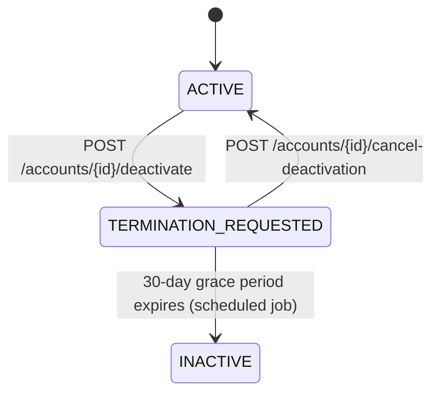

# Account Deactivation API Contract

> **Status:** APPROVED
> **Last Updated:** 2026-07-23

Manages the account deactivation lifecycle: a secretary initiates deactivation (triggering a 30-day grace period), during which the account remains billable. After grace expiry a scheduled job moves the account to inactive. Deactivation can be cancelled at any time before expiry, reverting the account to active.

---

## Endpoints

All endpoints require authentication. Base path: `/accounts`.

| Method | Path | Role Required | Description |
|--------|------|---------------|-------------|
| POST | `/accounts/{id}/deactivate` | SECRETARY | Initiate account deactivation (30-day grace period) |
| POST | `/accounts/{id}/cancel-deactivation` | SECRETARY | Cancel pending deactivation, revert to active |
| GET | `/accounts?status=termination_requested` | Any authenticated | List accounts pending deactivation with grace end dates |

---

## State Transition Diagram



---

## POST `/accounts/{id}/deactivate`

Initiates deactivation of an active account. Sets the status to `termination_requested` and starts a 30-day grace period.

### Request

Headers:

```
Authorization: Bearer <jwt>
Content-Type: application/json
Idempotency-Key: <unique-string>
```

Body:

```json
{
  "proofId": "uuid-of-deactivation-proof-attachment"
}
```

| Field | Type | Required | Description |
|-------|------|----------|-------------|
| `proofId` | `string (UUID)` | **Yes** | UUID of a previously uploaded deactivation proof attachment. |

### Success — `200 OK`

```json
{
  "result": "success",
  "message": "ok",
  "status": "200",
  "data": {
    "id": "uuid-of-account",
    "accountNumber": "71214756",
    "circuitId": "IC-AWZ-2200",
    "providerId": "uuid-of-provider",
    "storeId": "uuid-of-store",
    "planName": "Enterprise 100Mbps",
    "serviceType": "fiber",
    "speed": "100Mbps",
    "contractDurationMonths": 24,
    "contractStartDate": "2025-01-15",
    "contractEndDate": "2027-01-14",
    "notes": null,
    "installationFee": "5000.00",
    "rate": "5598.00",
    "installationDate": "2025-01-15",
    "billingPeriodLabel": null,
    "isProrated": false,
    "status": "termination_requested",
    "terminationRequestedAt": "2026-07-23T08:00:00Z",
    "graceEndDate": "2026-08-22T08:00:00Z",
    "subscriptionProofIds": ["uuid-of-subscription-proof", "uuid-of-deactivation-proof"],
    "createdAt": "2025-01-15T10:30:00Z",
    "updatedAt": "2026-07-23T08:00:00Z"
  }
}
```

### Error Responses

| Status | Condition | Body |
|--------|-----------|------|
| `404` | Account not found | `{"result":"error","status":"404","message":"account {id} not found","data":null}` |
| `409` | Account is not in `active` status | `{"result":"error","status":"409","message":"only active accounts can be deactivated","data":null}` |
| `409` | Idempotency-Key reused with different request body | `{"result":"error","status":"409","message":"idempotency key conflict","data":null}` |
| `422` | proofId is invalid or attachment doesn't exist | `{"result":"error","status":"422","message":"a valid deactivation proofId is required","data":null}` |
| `403` | Caller is not SECRETARY | Standard forbidden response |
| `401` | No bearer token | Standard unauthorized response |

---

## POST `/accounts/{id}/cancel-deactivation`

Cancels a pending deactivation, reverting the account to active status. Only accounts currently in `termination_requested` status can be cancelled.

### Request

Headers:

```
Authorization: Bearer <jwt>
Content-Type: application/json
```

Body:

```json
{
  "reason": "Customer renewed contract — deactivation no longer needed"
}
```

| Field | Type | Required | Description |
|-------|------|----------|-------------|
| `reason` | `string` | **Yes** | Textual explanation for why the deactivation is being cancelled. |

### Success — `200 OK`

```json
{
  "result": "success",
  "message": "ok",
  "status": "200",
  "data": {
    "id": "uuid-of-account",
    "accountNumber": "71214756",
    "circuitId": "IC-AWZ-2200",
    "providerId": "uuid-of-provider",
    "storeId": "uuid-of-store",
    "planName": "Enterprise 100Mbps",
    "serviceType": "fiber",
    "speed": "100Mbps",
    "contractDurationMonths": 24,
    "contractStartDate": "2025-01-15",
    "contractEndDate": "2027-01-14",
    "notes": null,
    "installationFee": "5000.00",
    "rate": "5598.00",
    "installationDate": "2025-01-15",
    "billingPeriodLabel": null,
    "isProrated": false,
    "status": "active",
    "terminationRequestedAt": null,
    "graceEndDate": null,
    "subscriptionProofIds": ["uuid-of-subscription-proof", "uuid-of-deactivation-proof"],
    "createdAt": "2025-01-15T10:30:00Z",
    "updatedAt": "2026-07-23T09:00:00Z"
  }
}
```

### Error Responses

| Status | Condition | Body |
|--------|-----------|------|
| `404` | Account not found | `{"result":"error","status":"404","message":"account {id} not found","data":null}` |
| `409` | Account is not in `termination_requested` status | `{"result":"error","status":"409","message":"only accounts in termination_requested status can have deactivation cancelled","data":null}` |
| `403` | Caller is not SECRETARY | Standard forbidden response |
| `401` | No bearer token | Standard unauthorized response |

---

## GET `/accounts` (with status filter)

Lists accounts filtered by status. Use `?status=termination_requested` to retrieve all accounts pending deactivation.

### Request

```
GET /accounts?status=termination_requested&limit=20&cursor=<cursor>
Authorization: Bearer <jwt>
```

Query parameters:

| Param | Type | Required | Description |
|-------|------|----------|-------------|
| `status` | `string` | No | Filter by account status: `active`, `termination_requested`, `transferred`, `inactive` |
| `storeId` | `string (UUID)` | No | Filter by store |
| `providerId` | `string (UUID)` | No | Filter by provider |
| `cursor` | `string` | No | Pagination cursor from previous response |
| `limit` | `integer` | No | Page size (default 20, max 100) |

### Success — `200 OK`

```json
{
  "result": "success",
  "message": "ok",
  "status": "200",
  "data": {
    "items": [
      {
        "id": "uuid-1",
        "accountNumber": "71214756",
        "circuitId": "IC-AWZ-2200",
        "providerId": "uuid-of-provider",
        "storeId": "uuid-of-store",
        "planName": "Enterprise 100Mbps",
        "serviceType": "fiber",
        "speed": "100Mbps",
        "contractDurationMonths": 24,
        "contractStartDate": "2025-01-15",
        "contractEndDate": "2027-01-14",
        "notes": null,
        "installationFee": "5000.00",
        "rate": "5598.00",
        "installationDate": "2025-01-15",
        "billingPeriodLabel": null,
        "isProrated": false,
        "status": "termination_requested",
        "terminationRequestedAt": "2026-07-20T10:00:00Z",
        "graceEndDate": "2026-08-19T10:00:00Z",
        "subscriptionProofIds": ["uuid-proof-1"],
        "createdAt": "2025-01-15T10:30:00Z",
        "updatedAt": "2026-07-20T10:00:00Z"
      }
    ],
    "nextCursor": "next-page-cursor-or-null"
  }
}
```

---

## Account Response Schema

The full Account JSON schema returned by all deactivation endpoints:

```json
{
  "id": "string (UUID)",
  "accountNumber": "string",
  "circuitId": "string | null",
  "providerId": "string (UUID)",
  "storeId": "string (UUID)",
  "planName": "string | null",
  "serviceType": "string | null",
  "speed": "string | null",
  "contractDurationMonths": "integer | null",
  "contractStartDate": "ISO date (YYYY-MM-DD) | null",
  "contractEndDate": "ISO date (YYYY-MM-DD) | null",
  "notes": "string | null",
  "installationFee": "decimal string | null",
  "rate": "decimal string (MRC)",
  "installationDate": "ISO date (YYYY-MM-DD)",
  "billingPeriodLabel": "string | null",
  "isProrated": "boolean",
  "status": "string (active | termination_requested | transferred | inactive)",
  "terminationRequestedAt": "ISO 8601 timestamp | null",
  "graceEndDate": "ISO 8601 timestamp | null",
  "subscriptionProofIds": ["array of UUID strings"],
  "createdAt": "ISO 8601 timestamp",
  "updatedAt": "ISO 8601 timestamp | null"
}
```

### Key Deactivation Fields

| Field | Type | Description |
|-------|------|-------------|
| `status` | `string` | `"termination_requested"` when deactivation is pending |
| `terminationRequestedAt` | `string (ISO 8601)` | Timestamp when deactivation was initiated; `null` if not pending deactivation |
| `graceEndDate` | `string (ISO 8601)` | Timestamp when the 30-day grace period expires; computed as `terminationRequestedAt + 30 days` (UTC); `null` if not pending deactivation |

---

## Grace Period Explanation

| Aspect | Detail |
|--------|--------|
| **Duration** | 30 calendar days from the `terminationRequestedAt` timestamp |
| **Computation** | `graceEndDate = terminationRequestedAt + 30 days` (UTC timezone) |
| **Billing** | Account remains billable (prorated) through grace-end date; topsheet compilation includes the account until expiry |
| **Expiry** | A daily scheduled job checks all `termination_requested` accounts and moves expired ones to `inactive` status |
| **Manual trigger** | `POST /admin/jobs/expire-grace` (SYSADMIN only) — runs the expiry check on demand |
| **Cancellation** | Account can be reverted to `active` at any time before grace expiry via `POST /accounts/{id}/cancel-deactivation` |

---

## Side Effects

1. **Activity log — deactivation requested**: Action `"account.deactivation_requested"` is recorded when a secretary initiates deactivation.
2. **Activity log — deactivation cancelled**: Action `"account.deactivation_cancelled"` is recorded when a secretary cancels a pending deactivation.
3. **Proof attachment linked**: The deactivation proof (`proofId`) is appended to the account's `subscriptionProofIds` list and viewable in the account's attachments.
4. **Account Change Requests blocked**: Submitting a change request for an account in `termination_requested` status returns `409 Conflict` with message `"can only submit changes for active accounts"`.

---

## Idempotency

The `POST /accounts/{id}/deactivate` endpoint supports idempotency via a request header:

```
Idempotency-Key: <unique-string>
```

| Scenario | Behavior |
|----------|----------|
| Same key + same body | Replays the stored response (no side effects re-executed) |
| Same key + different body | Returns `409 Conflict` |
| No key provided | Normal (non-idempotent) execution |

- **Scope**: Per-user, per-operation (`account.deactivate`).
- **Semantics**: Identical to the transfer endpoint's idempotency behavior.

---

## Code Examples

### cURL — Deactivate an account

```bash
curl -X POST "http://localhost:8080/accounts/{accountId}/deactivate" \
  -H "Authorization: Bearer <jwt>" \
  -H "Content-Type: application/json" \
  -H "Idempotency-Key: deactivate-{accountId}-20260723" \
  -d '{"proofId": "<proof-attachment-uuid>"}'
```

### cURL — Cancel a deactivation

```bash
curl -X POST "http://localhost:8080/accounts/{accountId}/cancel-deactivation" \
  -H "Authorization: Bearer <jwt>" \
  -H "Content-Type: application/json" \
  -d '{"reason": "Customer renewed contract"}'
```

### cURL — List accounts pending deactivation

```bash
curl "http://localhost:8080/accounts?status=termination_requested&limit=20" \
  -H "Authorization: Bearer <jwt>"
```

### JavaScript (Fetch) — Deactivate an account

```javascript
const response = await fetch(`/accounts/${accountId}/deactivate`, {
  method: 'POST',
  headers: {
    'Authorization': `Bearer ${token}`,
    'Content-Type': 'application/json',
    'Idempotency-Key': `deactivate-${accountId}-${Date.now()}`,
  },
  body: JSON.stringify({ proofId: proofAttachmentId }),
});
const { data: account } = await response.json();
// account.status === 'termination_requested'
// account.graceEndDate is set (30 days from now)
```

### JavaScript (Fetch) — Cancel a deactivation

```javascript
const response = await fetch(`/accounts/${accountId}/cancel-deactivation`, {
  method: 'POST',
  headers: {
    'Authorization': `Bearer ${token}`,
    'Content-Type': 'application/json',
  },
  body: JSON.stringify({ reason: 'Customer renewed contract' }),
});
const { data: account } = await response.json();
// account.status === 'active'
// account.terminationRequestedAt === null
// account.graceEndDate === null
```

### JavaScript (Fetch) — List accounts pending deactivation

```javascript
const response = await fetch(
  `/accounts?status=termination_requested&limit=20`,
  { headers: { 'Authorization': `Bearer ${token}` } },
);
const { data } = await response.json();
// data.items = array of Account objects with graceEndDate populated
// data.nextCursor = pagination cursor or null
```

---

## Frontend Guidance

1. **"Pending Deactivation" badge**: Display a prominent badge/indicator on accounts with `status === "termination_requested"`. Include a countdown showing remaining days until grace expiry.
2. **Countdown computation**: `remainingDays = Math.ceil((new Date(graceEndDate) - Date.now()) / 86400000)`. Show "X days remaining" or "Expires today" when ≤ 0.
3. **Disable edit actions**: For accounts in `termination_requested` status, disable account edit forms and change request submission (the backend will reject with 409 regardless).
4. **"Cancel Deactivation" button**: Show on accounts with `status === "termination_requested"`. On click, prompt the user for a cancellation reason (required text input), then call `POST /accounts/{id}/cancel-deactivation`.
5. **After cancellation**: Revert the UI to normal active state — remove the badge, re-enable edit actions, clear the grace period countdown.
6. **Proof upload flow**: Before calling deactivate, upload the deactivation proof via the presign flow (`POST /attachments/presign/upload` → `PUT /attachments/{id}/blob`), then include the resulting attachment UUID as `proofId` in the deactivation request body.
7. **Status filter**: Use the accounts list endpoint with `?status=termination_requested` to populate a "Pending Deactivation" dashboard view.
