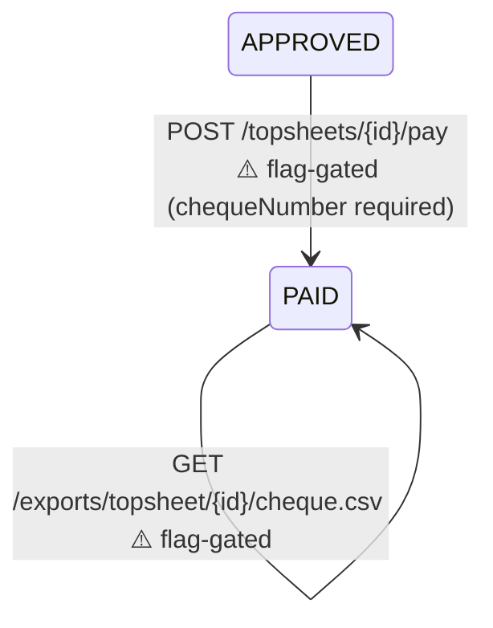

# TopSheet Cheque Payment — API Contract

**Feature:** Fully pay (close) a topsheet by recording the cheque number used to pay its accounts, then download a Cheque Payment Voucher as PDF or CSV.

Base URL: `/` · Auth: `Authorization: Bearer <JWT>`

**Prerequisite:** the topsheet must already be in `approved` status (released to finance). Reaching `approved` is covered by the TopSheet compilation lifecycle contract; this contract picks up from there.

> ### ⚠️ This entire feature is currently disabled
>
> `POST /topsheets/{id}/pay` and both cheque exports sit behind `TOPSHEET_RFP_FLOW_ENABLED`,
> which is **off by default** — together with `generate-rfp` and `release-to-finance`, whose
> `approved` status this feature requires. While it is off all three routes stay registered and
> answer **`503 Service Unavailable`**; no topsheet can reach `approved`, so none can be paid.
>
> The contract stays published because none of the code was removed: setting the variable to
> `true` restores everything below unchanged, with no migration and no backfill. See the callout
> in `TOPSHEET_COMPILE_API_CONTRACT.md`.

---

## Endpoints

All three answer `503` unless `TOPSHEET_RFP_FLOW_ENABLED=true`.

| Method | Path | Auth | Notes |
|--------|------|------|-------|
| POST | `/topsheets/{id}/pay` | Bearer (**finance**) | **⚠️** Record the cheque number and transition `approved` → `paid`. **Idempotent**. |
| GET | `/exports/topsheet/{id}/cheque.pdf` | Bearer (**secretary / finance**) | **⚠️** Download the Cheque Payment Voucher as a PDF. Requires the topsheet to be paid. |
| GET | `/exports/topsheet/{id}/cheque.csv` | Bearer (**secretary / finance**) | **⚠️** Download the same voucher as a CSV. Requires the topsheet to be paid. |

> `sysadmin` is admitted to every endpoint.

---

## State Transition



The cheque number is captured on the existing pay step — there is **no new status**. Once `paid`, the topsheet header carries `chequeNumber` and `paidAt`, and every line item flips to `paid`.

---

## POST `/topsheets/{id}/pay`

Records the cheque number used to pay the accounts on the topsheet and transitions it from `approved` to `paid`. Cascades all line items to `paid`. This is the "close" action — it is what fully settles the topsheet.

### Authorization

Bearer token. Allowed roles: **finance** (and `sysadmin`).

### Request

```json
{
  "chequeNumber": "CHQ-0001"
}
```

| Field | Type | Required | Validation |
|-------|------|----------|------------|
| `chequeNumber` | `string` | **Yes** | Trimmed; must be non-blank. A missing/empty/whitespace-only value is rejected with `400`. Free text — any bank/cheque numbering format is accepted. |

### Success — `200 OK`

```json
{
  "result": "success",
  "message": "success",
  "status": "200",
  "data": {
    "id": "a1b2c3d4-...",
    "invoiceNumber": "CONV-202607-0012",
    "billingPeriod": "2026-07",
    "providerId": "uuid",
    "providerName": "Converge",
    "accountCount": 43,
    "totalAmount": "119500.00",
    "batchNumber": "CONV-202607-B001",
    "status": "paid",
    "compilerId": "uuid",
    "approvedByFinanceId": "uuid",
    "approvedAt": "2026-07-24T02:00:00Z",
    "paidAt": "2026-07-27T06:15:00Z",
    "chequeNumber": "CHQ-0001",
    "compilationDate": "2026-07-21T08:15:00Z"
  }
}
```

### Response Fields — new / relevant on `TopSheet`

| Field | Type | Description |
|-------|------|-------------|
| `status` | `string` | Now `paid`. |
| `chequeNumber` | `string \| null` | **New.** The cheque number recorded at payment. `null` for topsheets not yet paid (and for legacy rows paid before this feature shipped). |
| `paidAt` | `string (ISO-8601) \| null` | Timestamp the topsheet was paid. Set at the same time as `chequeNumber`. |
| `approvedByFinanceId` | `string (UUID) \| null` | Who released the topsheet to finance. |
| `approvedAt` | `string (ISO-8601) \| null` | When it was released to finance. |

All other `TopSheet` fields are unchanged from the compilation contract.

### Idempotency

Idempotent via the `Idempotency-Key` header. Re-sending the same request (same key **and** same `chequeNumber`) replays the stored `paid` result without paying again. Reusing the same key with a **different** `chequeNumber` is rejected as an idempotency conflict (`409`).

```
Idempotency-Key: <unique-key>
```

### Constraints

- The topsheet must be in `approved` status; otherwise `409`.
- `chequeNumber` must be present and non-blank; otherwise `400`.
- Because the write is status-guarded, a second pay attempt after the topsheet is already `paid` returns `409`.

---

## GET `/exports/topsheet/{id}/cheque.pdf`

Downloads the **Cheque Payment Voucher** as a PDF. Only available once the topsheet has been paid (i.e. a `chequeNumber` is recorded).

### Authorization

Bearer token. Allowed roles: **secretary**, **finance** (and `sysadmin`).

### Document Layout

- Title `PUREGOLD PRICE CLUB, INC.` and subtitle `Cheque Payment Voucher`.
- Metadata block: `Provider`, `Invoice`, `Billing Period`, `Total Accounts`, **`Cheque Number`**, `Payment Date`.
- Signatories: `Noted by: Gilbert Arciaga`, `Approved by: Mr. Vincent Co`, `By: Mary Ann Agustin`.
- Account table (one row per line), then a `GRAND TOTAL` row.

| # | Column | Source (`TopSheetDetail`) |
|---|--------|---------------------------|
| 1 | NO. | Row number (1-based) |
| 2 | STORE CO | `branchCode` |
| 3 | STORE NAME | `storeName` |
| 4 | CID# | `circuitId` |
| 5 | ACCT# | `accountNumber` |
| 6 | MRC | `proratedAmount` |
| 7 | ARREARS | `arrearsAmount` |
| 8 | INVOICE NUMBER | **per-account** reference: `accountNumber` + the rental period as `MONYYYY` |

The INVOICE NUMBER column is per row, matching the TopSheet report: account `71214756`
billed for `2026-07` gives `71214756JUL2026`. The topsheet's own `invoiceNumber`
(`CONV-202607-0012`) identifies the compilation batch and appears only in the meta block
and the filename.

The `GRAND TOTAL` row breaks the total out across the last three columns: the MRC
subtotal (Σ `proratedAmount`) under **MRC**, the arrears subtotal (Σ `arrearsAmount`)
under **ARREARS**, and their sum under **INVOICE NUMBER**. That combined figure equals
the topsheet's `totalAmount` — the amount the cheque actually paid.

### Success — `200 OK`

| Header | Value |
|--------|-------|
| `Content-Type` | `application/pdf` |
| `Content-Disposition` | `attachment; filename="Cheque_<invoiceNumber>_<billingPeriod>.pdf"` |

Body: binary PDF bytes (starts with the magic bytes `%PDF`). Example filename: `Cheque_CONV-202607-0012_2026-07.pdf`.

---

## GET `/exports/topsheet/{id}/cheque.csv`

Downloads the same voucher data as a CSV (RFC-4180 quoted). Only available once the topsheet has been paid.

### Authorization

Bearer token. Allowed roles: **secretary**, **finance** (and `sysadmin`).

### Structure

```
Provider,Converge
Invoice,CONV-202607-0012
Billing Period,2026-07
Total Accounts,43
Cheque Number,CHQ-0001
Payment Date,2026-07-27T06:15:00Z

NO.,STORE CO,STORE NAME,CID#,ACCT#,MRC,ARREARS,INVOICE NUMBER
1,118,PUREGOLD QI CENTRAL,IC-AWZ-2200,71214756,5598.00,500.00,71214756JUL2026
2,050,PUREGOLD JR ANTIPOLO,,88123456,2798.00,0.00,88123456JUL2026
GRAND TOTAL,,,,,8396.00,500.00,8896.00
```

A metadata block (including `Cheque Number` and `Payment Date`) is followed by a blank line, the header row, one row per line, and a `GRAND TOTAL` row. Fields containing a comma, quote, or newline are wrapped in double quotes with inner quotes doubled.

The `GRAND TOTAL` row carries the MRC subtotal, the arrears subtotal, and their sum in the last three columns; the sum equals the topsheet's `totalAmount`.

### Success — `200 OK`

| Header | Value |
|--------|-------|
| `Content-Type` | `text/csv; charset=UTF-8` |
| `Content-Disposition` | `attachment; filename="Cheque_<invoiceNumber>_<billingPeriod>.csv"` |

Body: UTF-8 CSV text. Example filename: `Cheque_CONV-202607-0012_2026-07.csv`.

---

## Error Responses

All non-binary errors follow the standard envelope:

```json
{ "result": "error", "message": "descriptive error message", "status": "4xx", "data": null }
```

| Status | Endpoint | Condition | Message |
|--------|----------|-----------|---------|
| `400` | pay | `chequeNumber` missing / blank | `"chequeNumber is required to pay a topsheet"` |
| `409` | pay | Topsheet not in `approved` status | `"only approved topsheets can be paid (was <status>)"` |
| `409` | pay | Same Idempotency-Key reused with a different cheque | Idempotency conflict |
| `409` | cheque.pdf / cheque.csv | Topsheet has no cheque number yet (not paid) | `"topsheet <id> has no cheque number yet; pay it first"` (code `cheque_missing`) |
| `404` | all | Topsheet not found | `"topsheet <id> not found"` |
| `401` | all | Missing / invalid bearer token | Standard unauthorized response |
| `403` | all | Caller lacks the required role | Standard forbidden response |
| `503` | all | `TOPSHEET_RFP_FLOW_ENABLED=false` (the default) | `"<endpoint> is temporarily disabled on this deployment — …"` (code `feature_disabled`) |

While the feature is disabled the `503` **pre-empts every other row in this table**: the guard
runs before the role check and before any database read, so a wrong role yields `503` rather than
`403`, and an unknown id yields `503` rather than `404`. Only `401` still wins, because
authentication runs ahead of the route handler.

---

## Example — cURL

### Pay (close) with a cheque number
```bash
curl -X POST http://localhost:8080/topsheets/<topsheet-id>/pay \
  -H "Authorization: Bearer <jwt>" \
  -H "Content-Type: application/json" \
  -H "Idempotency-Key: pay-<topsheet-id>" \
  -d '{"chequeNumber":"CHQ-0001"}'
```

### Download the cheque PDF
```bash
curl -O -J http://localhost:8080/exports/topsheet/<topsheet-id>/cheque.pdf \
  -H "Authorization: Bearer <jwt>"
```

### Download the cheque CSV
```bash
curl -O -J http://localhost:8080/exports/topsheet/<topsheet-id>/cheque.csv \
  -H "Authorization: Bearer <jwt>"
```

---

## Example — JavaScript (Fetch)

```javascript
// 1. Record the cheque number and close the topsheet (Finance).
const payRes = await fetch(`/topsheets/${topsheetId}/pay`, {
  method: 'POST',
  headers: {
    Authorization: `Bearer ${token}`,
    'Content-Type': 'application/json',
    'Idempotency-Key': `pay-${topsheetId}`,
  },
  body: JSON.stringify({ chequeNumber }),
});
if (!payRes.ok) throw new Error((await payRes.json()).message);
const { data: paid } = await payRes.json();
console.log(`Paid ${paid.invoiceNumber} with cheque ${paid.chequeNumber}`);

// 2. Download a voucher (PDF or CSV) — binary attachment, bypasses the JSON envelope.
async function downloadVoucher(format /* 'pdf' | 'csv' */) {
  const res = await fetch(`/exports/topsheet/${topsheetId}/cheque.${format}`, {
    headers: { Authorization: `Bearer ${token}` },
  });
  if (!res.ok) throw new Error((await res.json()).message); // e.g. 409 before payment
  const blob = await res.blob();
  const url = URL.createObjectURL(blob);
  const a = document.createElement('a');
  a.href = url;
  a.download = res.headers
    .get('Content-Disposition')
    ?.match(/filename="(.+)"/)?.[1] ?? `cheque.${format}`;
  a.click();
  URL.revokeObjectURL(url);
}
```

---

## Notes for Frontend

- The cheque number is **mandatory** to pay/close a topsheet. Surface a required input on the pay action; an empty value returns `400`.
- `pay` is idempotent — safe to retry on a network timeout with the same `Idempotency-Key` and cheque number.
- Gate the two download buttons on `status === "paid"` (equivalently, `chequeNumber != null`). Calling either export before payment returns `409` with code `cheque_missing`.
- The export endpoints stream a **binary attachment** and bypass the standard JSON envelope. Read the `Content-Disposition` header for the suggested filename.
- The PDF and CSV present the same data as the topsheet's Excel export, plus the cheque number and payment date — no extra data needs to be assembled client-side.
- Only **finance** (and `sysadmin`) can pay; **secretary** and **finance** (and `sysadmin`) can download the vouchers.
