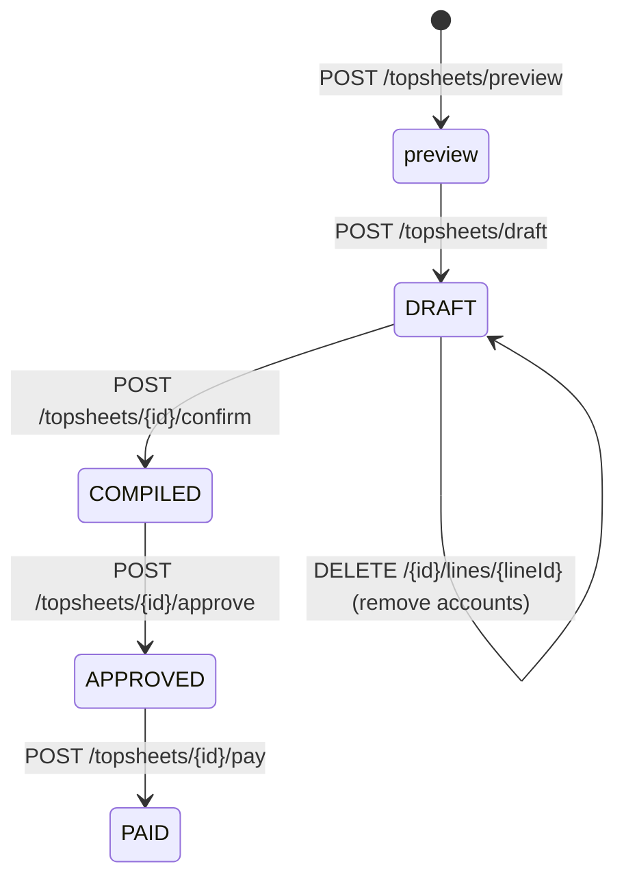

# TopSheet Two-Phase Compilation — API Contract

**Feature:** Two-phase topsheet compilation (Draft → Confirm) with RFP number entry and secretary review.

Base URL: `/` · Auth: `Authorization: Bearer <JWT>` · Role: **secretary** (unless noted).

---

## Endpoints

| Method | Path | Auth | Notes |
|--------|------|------|-------|
| POST | `/topsheets/preview` | Bearer (secretary) | Read-only preview of eligible accounts for a provider/period. No persistence. Unchanged from existing. |
| POST | `/topsheets/draft` | Bearer (secretary) | Create a DRAFT topsheet with all eligible accounts. **Idempotent**. |
| GET | `/topsheets/{id}/lines` | Bearer (any) | List all lines in a topsheet, sorted by store branchCode DESC (rfpSortOrder). |
| PATCH | `/topsheets/{id}/lines/{lineId}` | Bearer (secretary) | Edit a draft line's RFP number and/or prorated amount. |
| POST | `/topsheets/{id}/assign-rfp` | Bearer (secretary) | Bulk-assign a contiguous RFP number range across a draft's lines, sorted by store code. |
| DELETE | `/topsheets/{id}/lines/{lineId}` | Bearer (secretary) | Remove a line from a DRAFT topsheet. |
| POST | `/topsheets/{id}/confirm` | Bearer (secretary) | Re-validate and finalize: DRAFT → COMPILED. Mints invoice number. **Idempotent**. |

---

## State Transition Diagram



---

## POST `/topsheets/draft`

Creates a DRAFT topsheet with all eligible accounts for the given provider and billing period.

### Request

```json
{
  "providerId": "uuid-string",
  "billingPeriod": "2026-07"
}
```

| Field | Type | Required | Description |
|-------|------|----------|-------------|
| `providerId` | `string (UUID)` | **Yes** | The provider to compile accounts for. |
| `billingPeriod` | `string` | **Yes** | Billing period in `YYYY-MM` format. Cannot be a future month. |

### Success — `201 Created`

```json
{
  "result": "success",
  "message": "draft topsheet created",
  "status": "201",
  "data": {
    "id": "a1b2c3d4-...",
    "invoiceNumber": null,
    "billingPeriod": "2026-07",
    "providerId": "uuid",
    "providerName": "Converge",
    "accountCount": 45,
    "totalAmount": "125000.00",
    "batchNumber": "CONV-202607-B001",
    "status": "draft",
    "compilerId": "uuid",
    "compilationDate": "2026-07-21T07:30:00Z"
  }
}
```

### Response Fields — `TopSheet`

| Field | Type | Description |
|-------|------|-------------|
| `id` | `string (UUID)` | Unique topsheet identifier. |
| `invoiceNumber` | `string \| null` | `null` during DRAFT; populated after confirm. Format: `ACRONYM-YYYYMM-XXXX`. |
| `billingPeriod` | `string` | The billing period in `YYYY-MM` format. |
| `providerId` | `string (UUID)` | Provider this topsheet belongs to. |
| `providerName` | `string` | Snapshot of provider name at creation time. |
| `accountCount` | `integer` | Number of line items. |
| `totalAmount` | `string` | Sum of all line item prorated amounts (decimal string, e.g. `"125000.00"`). |
| `batchNumber` | `string` | System-generated batch identifier (format: `ACRONYM-YYYYMM-BNNN`). |
| `status` | `string` | One of: `draft`, `compiled`, `approved`, `paid`. |
| `compilerId` | `string (UUID)` | User who created the draft. |
| `compilationDate` | `string (ISO-8601)` | Timestamp of creation. |

---

## GET `/topsheets/{id}/lines`

Returns all line items for a topsheet, sorted by `rfpSortOrder` ASC (which corresponds to store branchCode descending).

### Success — `200 OK`

```json
{
  "result": "success",
  "message": "ok",
  "status": "200",
  "data": [
    {
      "id": "line-uuid",
      "topsheetId": "uuid",
      "accountId": "uuid",
      "billingPeriod": "2026-07",
      "proratedAmount": "5598.00",
      "fullAmount": "5598.00",
      "status": "billed",
      "branchCode": "118",
      "storeName": "PUREGOLD PRICE CLUB - QI CENTRAL",
      "circuitId": "IC-AWZ-2200",
      "accountNumber": "71214756",
      "accountStatus": "active",
      "rfpNumber": null,
      "rfpSortOrder": 1
    },
    {
      "id": "line-uuid-2",
      "topsheetId": "uuid",
      "accountId": "uuid-2",
      "billingPeriod": "2026-07",
      "proratedAmount": "2798.00",
      "fullAmount": "2798.00",
      "status": "billed",
      "branchCode": "050",
      "storeName": "PUREGOLD JR - ANTIPOLO",
      "circuitId": null,
      "accountNumber": "88123456",
      "accountStatus": "active",
      "rfpNumber": null,
      "rfpSortOrder": 2
    }
  ]
}
```

### Response Fields — `TopSheetDetail`

| Field | Type | Description |
|-------|------|-------------|
| `id` | `string (UUID)` | Unique line item identifier. |
| `topsheetId` | `string (UUID)` | Parent topsheet. |
| `accountId` | `string (UUID)` | The account being billed. |
| `billingPeriod` | `string` | Billing period (`YYYY-MM`). |
| `proratedAmount` | `string` | Prorated amount for this billing period (decimal string). Editable during DRAFT. |
| `fullAmount` | `string` | Full monthly recurring charge (MRC). |
| `status` | `string` | `billed` or `paid`. |
| `branchCode` | `string \| null` | Store branch code (used for RFP sort ordering). |
| `storeName` | `string \| null` | Store display name. |
| `circuitId` | `string \| null` | Circuit identifier. |
| `accountNumber` | `string \| null` | Account number. |
| `accountStatus` | `string \| null` | Account status at snapshot time. |
| `rfpNumber` | `string \| null` | RFP number (numeric-only free text). `null` until entered by secretary. |
| `rfpSortOrder` | `integer \| null` | Display order (1-based, assigned by store branchCode descending sort). |

---

## PATCH `/topsheets/{id}/lines/{lineId}`

Edit a draft line's RFP number and/or prorated amount.

### Request

```json
{
  "rfpNumber": "010001",
  "proratedAmount": "5000.00"
}
```

All fields are optional individually, but **at least one must be provided** — a body with
neither field is rejected with `400`.

| Field | Type | Required | Validation |
|-------|------|----------|------------|
| `rfpNumber` | `string \| null` | No | Must be numeric-only (regex `^\d+$`). Any length. Note: once set, an RFP number cannot be cleared back to `null` via PATCH. |
| `proratedAmount` | `string \| null` | No | Valid decimal money format (e.g., `"5000.00"`). Must be **greater than zero**; blank/zero/negative values are rejected with `400`. |

### Success — `200 OK`

```json
{
  "result": "success",
  "message": "ok",
  "status": "200",
  "data": { /* updated TopSheetDetail (same schema as GET /lines response) */ }
}
```

---

## POST `/topsheets/{id}/assign-rfp`

Bulk-assign a contiguous RFP number range across the lines of a DRAFT topsheet.
Store codes (`branchCode`) are numbered in **display order** — descending, matching
`GET /lines` (`rfpSortOrder`) — so the **top** line (highest store code) claims
`startRfpNumber` and the numbers grow downward. Each **distinct** store code claims the
next number in the `[startRfpNumber, endRfpNumber]` range, so every account sharing a
store code receives the **same** RFP number.

Lines with **no store code** (`branchCode` = `null`, e.g. an orphaned-store account) are
**skipped** — they are not numbered here (leave their `rfpNumber` `null` or set it with a
per-line `PATCH`) and do **not** count toward the required range size.

Example: store code `119` → `0100021`, store code `118` → `0100022` (higher code first).

### Request

```json
{
  "startRfpNumber": "0100021",
  "endRfpNumber": "0100025"
}
```

| Field | Type | Required | Validation |
|-------|------|----------|------------|
| `startRfpNumber` | `string` | Yes | Numeric-only (regex `^\d+$`). Leading zeros are preserved. |
| `endRfpNumber` | `string` | Yes | Numeric-only. Must be `>= startRfpNumber`. The range size (`end − start + 1`) must equal the number of distinct **non-null** store codes. |

The assigned numbers keep the width of the wider of the two inputs (e.g. a 7-digit
start stays 7 digits: `0100021`, `0100022`, …).

### Success — `200 OK`

Returns all lines in display order (same order and schema as `GET /lines`) with their
newly assigned RFP numbers, for the secretary to review before confirming.

```json
{
  "result": "success",
  "message": "ok",
  "status": "200",
  "data": [ /* TopSheetDetail[] in display order (same schema as GET /lines) */ ]
}
```

### Constraints
- TopSheet must be in `draft` status (else `409`).
- The draft must have at least one line (else `409`).
- `startRfpNumber` / `endRfpNumber` must be numeric-only (else `400`).
- `endRfpNumber` must be `>= startRfpNumber` (else `400`).
- `400` when the range size does not match the number of distinct **non-null** store codes
  (`"RFP range covers N number(s) but there are M store code(s) to number"`). A draft whose
  lines all lack a store code therefore also fails here (`0` store codes to number).

---

## DELETE `/topsheets/{id}/lines/{lineId}`

Remove a line from a DRAFT topsheet. Hard-deletes the line.

### Success — `204 No Content`

Empty response body.

### Constraints
- TopSheet must be in `draft` status.
- Cannot remove the last remaining line (at least 1 line must remain).

---

## POST `/topsheets/{id}/confirm`

Re-validates all remaining lines, mints the invoice number, and transitions the topsheet from DRAFT to COMPILED. After confirmation, the topsheet is immutable.

### Request

No request body required.

### Validation at Confirm Time

1. All lines must have a non-null `rfpNumber`.
2. All accounts re-validated for eligibility (installation date, termination status, provider match).
3. Double-billing guard checked (no account may be billed twice in the same period).

### Success — `200 OK`

```json
{
  "result": "success",
  "message": "topsheet compiled",
  "status": "200",
  "data": {
    "id": "uuid",
    "invoiceNumber": "CONV-202607-0012",
    "billingPeriod": "2026-07",
    "providerId": "uuid",
    "providerName": "Converge",
    "accountCount": 43,
    "totalAmount": "119500.00",
    "batchNumber": "CONV-202607-B001",
    "status": "compiled",
    "compilerId": "uuid",
    "compilationDate": "2026-07-21T08:15:00Z"
  }
}
```

---

## Idempotency

Both `POST /topsheets/draft` and `POST /topsheets/{id}/confirm` are idempotent via the `Idempotency-Key` header:

```
Idempotency-Key: <unique-key>
```

Re-sending the same request with the same idempotency key returns the original response without re-executing the operation.

---

## Error Responses

All errors follow the standard envelope:

```json
{
  "result": "error",
  "message": "descriptive error message",
  "status": "4xx",
  "data": null
}
```

| Status | Condition | Message |
|--------|-----------|---------|
| `400` | Invalid billingPeriod format | `"billingPeriod must be YYYY-MM"` |
| `400` | Future billing period selected | `"Cannot select a future billing period"` |
| `400` | RFP number contains non-numeric characters | `"rfpNumber must be numeric only"` |
| `400` | PATCH with neither field provided | `"at least one of rfpNumber or proratedAmount must be provided"` |
| `400` | PATCH proratedAmount blank / zero / negative | `"proratedAmount must be greater than zero"` (or `"… must be a valid decimal amount"`) |
| `400` | assign-rfp start/end non-numeric | `"startRfpNumber must be numeric only"` / `"endRfpNumber must be numeric only"` |
| `400` | assign-rfp end < start | `"endRfpNumber must be greater than or equal to startRfpNumber"` |
| `400` | assign-rfp range size ≠ distinct store codes | `"RFP range covers N number(s) but there are M store code(s) to number"` |
| `400` | Confirm with missing RFP numbers | `"All lines must have an RFP number before confirming"` |
| `404` | Provider not found | `"provider {id} not found"` |
| `404` | TopSheet not found | `"topsheet {id} not found"` |
| `404` | Line not found | `"line {id} not found"` |
| `409` | No eligible accounts for period | `"no eligible accounts to compile for provider {id} / {period}"` |
| `409` | TopSheet not in DRAFT status | `"only draft topsheets can be edited (was compiled)"` |
| `409` | Account ineligible at confirm time | `"accounts no longer eligible: [{accountId}, ...]"` |
| `409` | Double-billing detected at confirm | `"accounts already billed in this period: [{accountId}, ...]"` |
| `409` | Cannot remove last line | `"Cannot remove all lines; delete the draft instead"` |
| `409` | assign-rfp / confirm on a draft with no lines | `"draft topsheet {id} has no lines to number"` / `"… to confirm"` |
| `409` | Draft already exists for provider/period | `"a draft already exists for this provider/period"` |
| `401` | No bearer token | Standard unauthorized response. |
| `403` | Caller lacks required role | Standard forbidden response. |

---

## Example — cURL

### Create Draft
```bash
curl -X POST http://localhost:8080/topsheets/draft \
  -H "Authorization: Bearer <jwt>" \
  -H "Content-Type: application/json" \
  -H "Idempotency-Key: draft-conv-202607" \
  -d '{"providerId":"<provider-uuid>","billingPeriod":"2026-07"}'
```

### Edit Line RFP
```bash
curl -X PATCH http://localhost:8080/topsheets/<topsheet-id>/lines/<line-id> \
  -H "Authorization: Bearer <jwt>" \
  -H "Content-Type: application/json" \
  -d '{"rfpNumber":"010001"}'
```

### Remove Line
```bash
curl -X DELETE http://localhost:8080/topsheets/<topsheet-id>/lines/<line-id> \
  -H "Authorization: Bearer <jwt>"
```

### Confirm Draft
```bash
curl -X POST http://localhost:8080/topsheets/<topsheet-id>/confirm \
  -H "Authorization: Bearer <jwt>" \
  -H "Idempotency-Key: confirm-<topsheet-id>"
```

---

## Example — JavaScript / Fetch

```javascript
// 1. Create Draft
const draftRes = await fetch('/topsheets/draft', {
  method: 'POST',
  headers: {
    'Authorization': `Bearer ${token}`,
    'Content-Type': 'application/json',
    'Idempotency-Key': `draft-${providerId}-${billingPeriod}`,
  },
  body: JSON.stringify({ providerId, billingPeriod: '2026-07' }),
});
const { data: draft } = await draftRes.json();
console.log(`Draft created: ${draft.id}, batch: ${draft.batchNumber}`);

// 2. Get Lines (sorted by store code DESC)
const linesRes = await fetch(`/topsheets/${draft.id}/lines`, {
  headers: { 'Authorization': `Bearer ${token}` },
});
const { data: lines } = await linesRes.json();

// 3. Assign RFP numbers per line
for (let i = 0; i < lines.length; i++) {
  const rfpNumber = String(10001 + i).padStart(6, '0'); // e.g., "010001"
  await fetch(`/topsheets/${draft.id}/lines/${lines[i].id}`, {
    method: 'PATCH',
    headers: {
      'Authorization': `Bearer ${token}`,
      'Content-Type': 'application/json',
    },
    body: JSON.stringify({ rfpNumber }),
  });
}

// 4. Confirm
const confirmRes = await fetch(`/topsheets/${draft.id}/confirm`, {
  method: 'POST',
  headers: {
    'Authorization': `Bearer ${token}`,
    'Idempotency-Key': `confirm-${draft.id}`,
  },
});
const { data: compiled } = await confirmRes.json();
console.log(`Compiled: ${compiled.invoiceNumber}`);
```

---

## Notes for Frontend

- Draft lines are returned sorted by `rfpSortOrder` (store branchCode descending). Display them in this order for RFP number alignment.
- RFP numbers come from an external system; the secretary enters them per-line in the displayed order.
- The `batchNumber` field is system-generated at draft creation and can be used to reference the compilation batch in the external RFP system.
- `invoiceNumber` is `null` during DRAFT phase; only populated after confirm.
- Use `GET /topsheets?status=draft&providerId=X` to check if an active draft exists before attempting to create one.
- The confirm endpoint is idempotent — safe to retry on network timeout.
- After confirm, the topsheet is immutable (cannot be cancelled or voided).
- The `proratedAmount` on each line can be overridden by the secretary during review to handle special billing cases.
