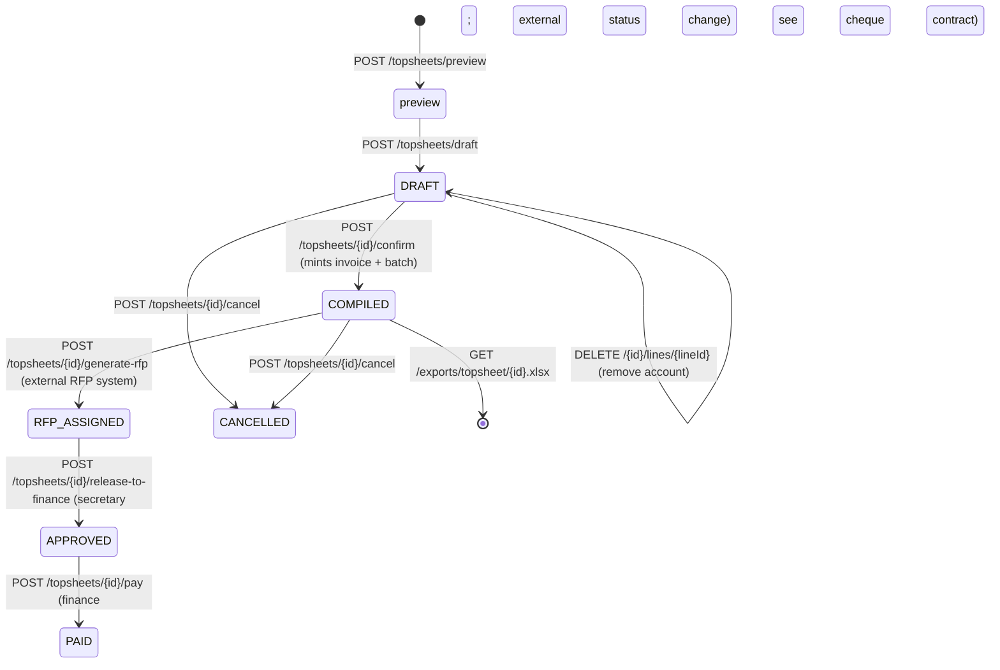

# TopSheet Two-Phase Compilation — API Contract

**Feature:** Two-phase topsheet compilation (Draft → Confirm) with secretary review, then
external RFP generation and release to finance.

Base URL: `/` · Auth: `Authorization: Bearer <JWT>` · Role: **secretary** (unless noted).

> RFP numbers are assigned by an **external RFP system** via `generate-rfp` **after** confirm —
> they are never entered per line by the secretary. Invoice and batch numbers are minted at
> **confirm**, not at draft.

---

## Endpoints

| Method | Path | Auth | Notes |
|--------|------|------|-------|
| GET | `/topsheets` | Bearer (any) | List topsheets (cursor paginated). Query: `providerId`, `billingPeriod`, `status`, `cursor`, `limit`. Includes drafts. |
| GET | `/topsheets/{id}` | Bearer (any) | Fetch a single topsheet header. |
| POST | `/topsheets/preview` | Bearer (secretary) | Read-only preview of eligible accounts for a provider/period. No persistence. |
| POST | `/topsheets/draft` | Bearer (secretary) | Create a DRAFT topsheet with all eligible accounts. **Idempotent**. |
| GET | `/topsheets/{id}/lines` | Bearer (any) | List all lines, sorted by store branchCode DESC (rfpSortOrder). |
| GET | `/topsheets/{id}/details` | Bearer (any) | Alias of `/lines`. |
| PATCH | `/topsheets/{id}/lines/{lineId}` | Bearer (secretary) | Override a draft line's prorated amount. |
| DELETE | `/topsheets/{id}/lines/{lineId}` | Bearer (secretary) | Remove a line from a DRAFT topsheet. |
| POST | `/topsheets/{id}/confirm` | Bearer (secretary) | Re-validate and finalize: DRAFT → COMPILED. Mints invoice + batch numbers. **Idempotent**. |
| POST | `/topsheets/{id}/cancel` | Bearer (secretary) | Void a DRAFT or COMPILED topsheet: → CANCELLED. Drops its lines. |
| POST | `/topsheets/{id}/generate-rfp` | Bearer (secretary) | Call the external RFP system to assign an RFP number + unique key per line: COMPILED → RFP_ASSIGNED. **Idempotent**. |
| POST | `/topsheets/{id}/release-to-finance` | Bearer (secretary) | Notify the external system and hand the batch to finance: RFP_ASSIGNED → APPROVED. |
| GET | `/exports/topsheet/{id}.xlsx` | Bearer (secretary, finance) | Download the compiled TopSheet as an Excel spreadsheet. |

Payment (`POST /topsheets/{id}/pay`, finance-only) and the cheque exports are documented in
`CHEQUE_PAYMENT_API_CONTRACT.md`.

---

## State Transition Diagram


```mermaid
stateDiagram-v2
    [*] --> preview: POST /topsheets/preview
    preview --> DRAFT: POST /topsheets/draft
    DRAFT --> COMPILED: POST /topsheets/{id}/confirm (mints invoice + batch)
    COMPILED --> RFP_ASSIGNED: POST /topsheets/{id}/generate-rfp (external RFP system)
    RFP_ASSIGNED --> APPROVED: POST /topsheets/{id}/release-to-finance (secretary; external status change)
    APPROVED --> PAID: POST /topsheets/{id}/pay (finance; see cheque contract)
    DRAFT --> CANCELLED: POST /topsheets/{id}/cancel
    COMPILED --> CANCELLED: POST /topsheets/{id}/cancel
    DRAFT --> DRAFT: PATCH /{id}/lines/{lineId} (edit amount)
    DRAFT --> DRAFT: DELETE /{id}/lines/{lineId} (remove account)
    COMPILED --> [*]: GET /exports/topsheet/{id}.xlsx
```

**Notes:**
- `approved` means "released to finance" — there is no separate Finance approval step.
- `cancelled` is a secretary void, allowed only **while RFP is not yet assigned** (status `draft`
  or `compiled`). The header is kept for audit; its lines are deleted so the accounts become
  re-billable. Once `rfp_assigned` or beyond, cancel is rejected (409).
- RFP numbers are assigned by the external system, **after** confirm.

---

## POST `/topsheets/draft`

Creates a DRAFT topsheet with all eligible accounts for the given provider and billing period.

### Request

```json
{ "providerId": "uuid-string", "billingPeriod": "2026-07" }
```

| Field | Type | Required | Description |
|-------|------|----------|-------------|
| `providerId` | `string (UUID)` | **Yes** | The provider to compile accounts for. |
| `billingPeriod` | `string` | **Yes** | Billing period in `YYYY-MM`. Cannot be a future month. |

### Success — `201 Created`

```json
{
  "result": "success",
  "message": "created",
  "status": "201",
  "data": {
    "id": "a1b2c3d4-...",
    "invoiceNumber": null,
    "batchNumber": null,
    "billingPeriod": "2026-07",
    "providerId": "uuid",
    "providerName": "Converge",
    "accountCount": 45,
    "totalAmount": "125000.00",
    "status": "draft",
    "compilerId": "uuid",
    "compilationDate": "2026-07-21T07:30:00Z"
  }
}
```

`invoiceNumber` and `batchNumber` are **null during DRAFT** — both are minted at confirm.

### Response Fields — `TopSheet`

| Field | Type | Description |
|-------|------|-------------|
| `id` | `string (UUID)` | Unique topsheet identifier. |
| `invoiceNumber` | `string \| null` | `null` until confirm. Format: `ACRONYM-YYYYMM-XXXX`. |
| `batchNumber` | `string \| null` | `null` until confirm. Format: `ACRONYM-YYYYMM-BNNN`. |
| `billingPeriod` | `string` | Billing period `YYYY-MM`. |
| `providerId` | `string (UUID) \| null` | Provider this topsheet belongs to. |
| `providerName` | `string \| null` | Snapshot of provider name at creation time. |
| `accountCount` | `integer` | Number of line items. |
| `totalAmount` | `string` | Sum of line prorated + arrears amounts (decimal string). |
| `status` | `string` | One of: `draft`, `compiled`, `rfp_assigned`, `approved`, `paid`, `cancelled`. |
| `compilerId` | `string (UUID)` | User who created the draft. |
| `approvedByFinanceId` | `string (UUID) \| null` | Who released to finance (set at release). |
| `approvedAt` | `string (ISO-8601) \| null` | When released to finance. |
| `paidAt` | `string (ISO-8601) \| null` | When paid (see cheque contract). |
| `chequeNumber` | `string \| null` | Cheque used to pay (see cheque contract). |
| `compilationDate` | `string (ISO-8601)` | Set at confirm (draft-creation time until then). |

---

## GET `/topsheets/{id}/lines`

Returns all line items, sorted by `rfpSortOrder` ASC (store branchCode descending).

### Response Fields — `TopSheetDetail`

| Field | Type | Description |
|-------|------|-------------|
| `id` | `string (UUID)` | Unique line item identifier. |
| `topsheetId` | `string (UUID)` | Parent topsheet. |
| `accountId` | `string (UUID)` | The account being billed. |
| `billingPeriod` | `string` | Billing period (`YYYY-MM`). |
| `proratedAmount` | `string` | Prorated current-period charge (decimal). Editable during DRAFT. |
| `fullAmount` | `string` | Full monthly recurring charge (MRC). |
| `status` | `string` | `billed` or `paid`. |
| `branchCode` | `string \| null` | Store branch code (RFP sort ordering). |
| `storeName` | `string \| null` | Store display name. |
| `circuitId` | `string \| null` | Circuit identifier. |
| `accountNumber` | `string \| null` | Account number. |
| `accountStatus` | `string \| null` | Account status at snapshot time. |
| `rfpNumber` | `string \| null` | `null` until `generate-rfp` assigns it (after confirm). |
| `rfpUniqueKey` | `string \| null` | External RFP system key; `null` until `generate-rfp`. |
| `rfpSortOrder` | `integer \| null` | Display order (1-based, store branchCode DESC). |
| `arrearsAmount` | `string` | Lumped recovery of un-billed prior periods; `"0.00"` when none. |
| `arrearsPeriods` | `string[]` | The `YYYY-MM` periods folded into `arrearsAmount`. |

---

## PATCH `/topsheets/{id}/lines/{lineId}`

Override a draft line's prorated amount. (RFP numbers are **not** entered here — they come from the
external system after confirm.)

### Request

```json
{ "proratedAmount": "5000.00" }
```

| Field | Type | Required | Validation |
|-------|------|----------|------------|
| `proratedAmount` | `string` | **Yes** | Valid decimal money. Must be **> 0** and **≤ the line's `fullAmount`** (a within-period charge cannot exceed the full monthly rate). Blank/zero/negative/over-MRC → `400`. |

### Success — `200 OK` — the updated `TopSheetDetail`.

---

## DELETE `/topsheets/{id}/lines/{lineId}`

Remove a line from a DRAFT topsheet (hard delete).

### Success — `204 No Content`

### Constraints
- TopSheet must be in `draft` status (else `409`).
- Cannot remove the **last** remaining line — cancel the topsheet instead (else `409`).

---

## POST `/topsheets/{id}/confirm`

Re-validates all remaining lines, recalculates totals, mints the invoice + batch numbers, and
transitions DRAFT → COMPILED. After confirmation the topsheet is immutable except for cancel
(allowed until RFP is assigned).

### Request

```json
{ "acknowledgeArrears": false }
```

| Field | Type | Required | Description |
|-------|------|----------|-------------|
| `acknowledgeArrears` | `boolean` | No (default `false`) | Must be `true` when any line carries arrears (`arrearsAmount > 0`), else the confirm is rejected `400`. An empty body is treated as `{ "acknowledgeArrears": false }`. |

### Validation at Confirm Time
1. TopSheet must be `draft` (else `409`).
2. The draft must have at least one line (else `409`).
3. Any arrears line requires `acknowledgeArrears: true` (else `400`).
4. All accounts re-validated for eligibility (provider match, termination, transfer) — else `409`.
5. Double-billing guard: no account already billed in this period (else `409`).
6. Arrears freshness: no arrears period already recovered on another (committed) topsheet since the
   draft was created (else `409 arrears_stale`).

### Success — `200 OK` — the COMPILED `TopSheet` with `invoiceNumber` + `batchNumber` populated.

---

## POST `/topsheets/{id}/cancel`

Void a DRAFT or COMPILED topsheet. The header is retained with status `cancelled` (its
`accountCount`/`totalAmount` snapshot preserved for audit); its line items are deleted so the
accounts free up for re-billing. Blocked once the topsheet has reached `rfp_assigned` or beyond.

### Request — no body.

### Success — `200 OK` — the `TopSheet` with `status: "cancelled"`.

### Constraints
- TopSheet must be `draft` or `compiled` (else `409`).

---

## POST `/topsheets/{id}/generate-rfp`

Calls the external RFP system to assign an RFP number + unique key per line, moving
COMPILED → RFP_ASSIGNED. **Idempotent** (a retry with the same `Idempotency-Key` replays rather than
re-calling the external system).

### Success — `200 OK` — all lines (display order) with their newly assigned `rfpNumber` + `rfpUniqueKey`.

### Constraints
- TopSheet must be `compiled` (else `409`).
- The external system must return exactly one assignment per line (else `409 rfp_incomplete`).

---

## POST `/topsheets/{id}/release-to-finance`

Notifies the external system to move the payment transaction to finance, then transitions
RFP_ASSIGNED → APPROVED (`approved` == "released to finance").

### Success — `200 OK` — the `TopSheet` with `status: "approved"`, `approvedByFinanceId`/`approvedAt` set.

### Constraints
- TopSheet must be `rfp_assigned` (else `409`).
- External rejection → `409 rfp_release_failed`.

---

## GET `/exports/topsheet/{id}.xlsx`

Downloads the compiled TopSheet report as an Excel spreadsheet. Bypasses the JSON
response envelope — the body is the raw workbook.

### Path Parameters

| Parameter | Type | Description |
|-----------|------|-------------|
| `id` | `string (UUID)` | The TopSheet ID. |

### Authorization

Bearer token. Allowed roles: **secretary**, **finance**.

### Workbook Layout

Sheet `TopSheet Report`: the title `PUREGOLD PRICE CLUB, INC.`, the subtitle
`TopSheet Report`, a metadata block (`Provider`, `Invoice`, `Billing Period`,
`Total Accounts`) with the fixed signatories (`By` Mary Ann Agustin, `Noted by`
Gilbert Arciaga, `Approved by` Mr. Vincent Co) alongside it, then the line table.

| # | Column | Source |
|---|--------|--------|
| 1 | NO. | Row number (1-based) |
| 2 | STORE CO | line `branchCode` |
| 3 | STORE NAME | line `storeName` |
| 4 | CID# | line `circuitId` |
| 5 | ACCT# | line `accountNumber` |
| 6 | MRC | line `proratedAmount` |
| 7 | ARREARS | line `arrearsAmount` |
| 8 | INVOICE NUMBER | topsheet `invoiceNumber` (the same value on every row) |

The closing `GRAND TOTAL` row carries the MRC subtotal under **MRC**, the arrears
subtotal under **ARREARS**, and their sum under **INVOICE NUMBER**; that sum equals
the topsheet's `totalAmount`.

### Success — `200 OK`

| Header | Value |
|--------|-------|
| `Content-Type` | `application/vnd.openxmlformats-officedocument.spreadsheetml.sheet` |
| `Content-Disposition` | `attachment; filename="TopSheet_{invoiceNumber}_{billingPeriod}.xlsx"` |

Body: binary Excel bytes.

### Error Responses

| Status | Condition |
|--------|-----------|
| `401` | No/invalid bearer token. |
| `403` | Caller lacks the secretary or finance role. |
| `404` | TopSheet not found. |

---

## Idempotency

`POST /topsheets/draft`, `/confirm`, `/generate-rfp`, and `/pay` honor an optional
`Idempotency-Key` header:

```
Idempotency-Key: <unique-key>
```

Re-sending the same request with the same key replays the stored response without re-executing.
**Idempotency is opt-in:** with no header there is no replay — a retry after a successful mutation
is instead caught by the status guard (e.g. a second `confirm` returns `409`, not the original
`200`). Reusing a key with a different request body → `409 idempotency_conflict`.

---

## Error Responses

Standard envelope: `{ "result": "error", "status": "4xx", "message": "...", "data": null }`.

| Status | Condition | Message |
|--------|-----------|---------|
| `400` | Invalid billingPeriod format | `"billingPeriod must be YYYY-MM"` |
| `400` | Future billing period | `"Cannot select a future billing period"` |
| `400` | PATCH amount blank / non-decimal | `"proratedAmount must be a valid decimal amount"` |
| `400` | PATCH amount ≤ 0 | `"proratedAmount must be greater than zero"` |
| `400` | PATCH amount over MRC | `"proratedAmount cannot exceed the line's full monthly charge (<fullAmount>)"` |
| `400` | Confirm with unacknowledged arrears | `"N account(s) carry arrears; acknowledgeArrears is required to confirm"` |
| `404` | Provider not found | `"provider {id} not found"` |
| `404` | TopSheet not found | `"topsheet {id} not found"` |
| `404` | Line not found | `"line {id} not found"` |
| `409` | Draft already exists for provider/period | `"a draft already exists for this provider/period"` (`draft_exists`) |
| `409` | No eligible accounts | `"no eligible accounts to compile for provider {id} / {period}"` (`nothing_to_compile`) |
| `409` | Edit/remove on a non-DRAFT | `"only draft topsheets can be edited (was <status>)"` |
| `409` | Remove the last line | `"Cannot remove the last line; cancel the topsheet instead"` |
| `409` | Confirm on a non-DRAFT | `"only draft topsheets can be confirmed (was <status>)"` |
| `409` | Account ineligible at confirm | `"accounts no longer eligible: [...]"` |
| `409` | Double-billing at confirm | `"accounts already billed in this period: [...]"` |
| `409` | Arrears already recovered since draft | `"arrears periods already recovered on another topsheet since draft; re-preview required: [...]"` (`arrears_stale`) |
| `409` | Cancel on a non-DRAFT/COMPILED | `"only draft or compiled topsheets can be cancelled (was <status>)"` |
| `409` | generate-rfp on a non-COMPILED | `"only compiled topsheets can generate RFP numbers (was <status>)"` |
| `409` | External RFP returned wrong count | `"external RFP system returned N assignment(s) for M line(s)"` (`rfp_incomplete`) |
| `409` | release on a non-RFP_ASSIGNED | `"only rfp_assigned topsheets can be released to finance (was <status>)"` |
| `409` | External release rejected | `"external RFP system rejected the release"` (`rfp_release_failed`) |
| `401` | No/invalid bearer token | Standard unauthorized response. |
| `403` | Caller lacks required role | Standard forbidden response. |

---

## Example — cURL

### Create draft
```bash
curl -X POST http://localhost:8080/topsheets/draft \
  -H "Authorization: Bearer <jwt>" \
  -H "Content-Type: application/json" \
  -H "Idempotency-Key: draft-conv-202607" \
  -d '{"providerId":"<provider-uuid>","billingPeriod":"2026-07"}'
```

### Override a draft line's prorated amount
```bash
curl -X PATCH http://localhost:8080/topsheets/<topsheet-id>/lines/<line-id> \
  -H "Authorization: Bearer <jwt>" \
  -H "Content-Type: application/json" \
  -d '{"proratedAmount":"1250.00"}'
```

### Remove a line
```bash
curl -X DELETE http://localhost:8080/topsheets/<topsheet-id>/lines/<line-id> \
  -H "Authorization: Bearer <jwt>"
```

### Confirm the draft
```bash
curl -X POST http://localhost:8080/topsheets/<topsheet-id>/confirm \
  -H "Authorization: Bearer <jwt>" \
  -H "Idempotency-Key: confirm-<topsheet-id>"
```

### Download the Excel export
```bash
curl -O -J http://localhost:8080/exports/topsheet/<topsheet-id>.xlsx \
  -H "Authorization: Bearer <jwt>"
```

---

## Example — JavaScript / Fetch

```javascript
// 1. Create the draft
const draftRes = await fetch('/topsheets/draft', {
  method: 'POST',
  headers: {
    'Authorization': `Bearer ${token}`,
    'Content-Type': 'application/json',
    'Idempotency-Key': `draft-${providerId}-${billingPeriod}`,
  },
  body: JSON.stringify({ providerId, billingPeriod: '2026-07' }),
});
const { data: draft } = await draftRes.json();

// 2. Review the lines (sorted by store branchCode DESC)
const linesRes = await fetch(`/topsheets/${draft.id}/lines`, {
  headers: { 'Authorization': `Bearer ${token}` },
});
const { data: lines } = await linesRes.json();

// 3. Confirm — mints the invoice + batch numbers
const confirmRes = await fetch(`/topsheets/${draft.id}/confirm`, {
  method: 'POST',
  headers: {
    'Authorization': `Bearer ${token}`,
    'Idempotency-Key': `confirm-${draft.id}`,
  },
});
const { data: compiled } = await confirmRes.json();
console.log(`Compiled: ${compiled.invoiceNumber} / ${compiled.batchNumber}`);

// 4. RFP numbers are assigned afterwards by the external system
await fetch(`/topsheets/${draft.id}/generate-rfp`, {
  method: 'POST',
  headers: { 'Authorization': `Bearer ${token}` },
});
```

---

## Notes for Frontend

- Draft lines are returned sorted by `rfpSortOrder` (store branchCode descending). Display in this order.
- `invoiceNumber` and `batchNumber` are `null` during DRAFT; both are populated after confirm.
- RFP numbers are assigned by the external system via `generate-rfp` (after confirm) — the frontend
  never enters them per line.
- Use `GET /topsheets?status=draft&providerId=X` to check for an open draft before creating one.
- To discard an unwanted draft (or a compiled topsheet before RFP), call `POST /{id}/cancel` — this
  frees the accounts so a corrected topsheet can be drafted for the same provider/period.
- The `proratedAmount` on each line can be overridden during review, within `[0.01, fullAmount]`.
- After `rfp_assigned`, the topsheet can no longer be cancelled.
- The Excel export is available for any compiled, rfp_assigned, approved or paid topsheet. Its
  filename carries the invoice number, so it is only meaningful once `invoiceNumber` is populated.
